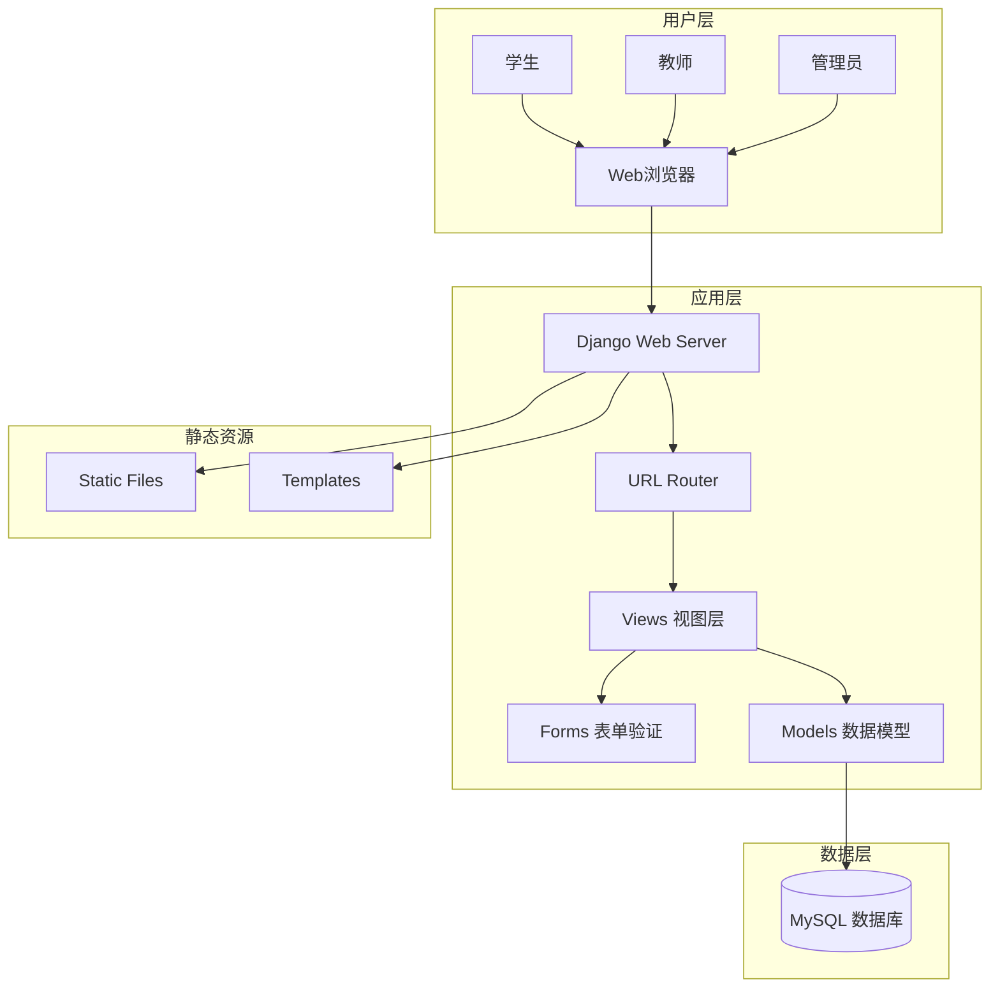
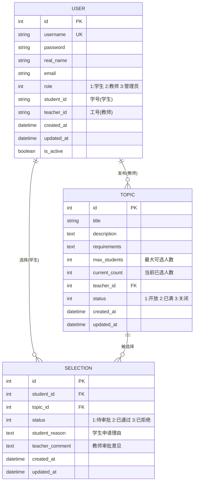

# 论文选题系统 - 项目设计文档

## 1. 系统架构

## 2. ER 图

## 3. 接口清单

### 3.1 认证模块 (accounts)

| 方法     | URL                | 描述     |
| -------- | ------------------ | -------- |
| GET/POST | /accounts/login/   | 用户登录 |
| GET      | /accounts/logout/  | 用户登出 |
| GET      | /accounts/profile/ | 个人信息 |

### 3.2 论文题目模块 (topics)

| 方法     | URL                  | 描述               |
| -------- | -------------------- | ------------------ |
| GET      | /topics/             | 题目列表(学生浏览) |
| GET      | /topics/<id>/        | 题目详情           |
| GET      | /topics/teacher/     | 教师发布的题目列表 |
| GET/POST | /topics/create/      | 创建题目(教师)     |
| GET/POST | /topics/<id>/edit/   | 编辑题目(教师)     |
| POST     | /topics/<id>/delete/ | 删除题目(教师)     |

### 3.3 选题模块 (selections)

| 方法 | URL                           | 描述               |
| ---- | ----------------------------- | ------------------ |
| POST | /selections/apply/<topic_id>/ | 学生申请选题       |
| GET  | /selections/my/               | 我的选题记录(学生) |
| GET  | /selections/pending/          | 待审批列表(教师)   |
| POST | /selections/<id>/approve/     | 通过申请(教师)     |
| POST | /selections/<id>/reject/      | 拒绝申请(教师)     |

## 4. UI/UX 规范

### 4.1 色彩系统

- **主色调**: #4A90D9 (学术蓝)
- **成功色**: #52C41A
- **警告色**: #FAAD14
- **错误色**: #FF4D4F
- **背景色**: #F5F7FA
- **卡片背景**: #FFFFFF
- **文字主色**: #303133
- **文字次色**: #606266

### 4.2 字体规范

- **主字体**: "PingFang SC", "Microsoft YaHei", sans-serif
- **标题字号**: 24px / 20px / 16px
- **正文字号**: 14px
- **辅助字号**: 12px

### 4.3 间距规范

- **页面边距**: 24px
- **卡片内边距**: 20px
- **元素间距**: 16px / 12px / 8px

### 4.4 圆角规范

- **卡片圆角**: 8px
- **按钮圆角**: 4px
- **输入框圆角**: 4px

## 5. 页面清单

1. **登录页面** - /accounts/login/
2. **论文题目列表页** - /topics/ (学生浏览所有开放题目)
3. **论文题目详情页** - /topics/<id>/ (查看题目详细介绍)
4. **选题申请页** - /selections/apply/<topic_id>/ (学生提交选题申请)
5. **我的选题页** - /selections/my/ (学生查看自己的选题状态)
6. **教师题目管理页** - /topics/teacher/ (教师管理自己发布的题目)
7. **审批管理页** - /selections/pending/ (教师审批学生的选题申请)
